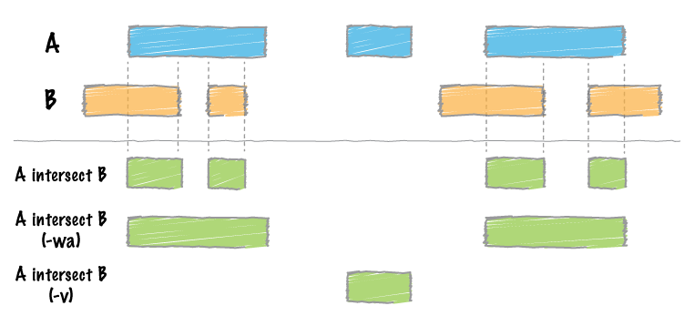
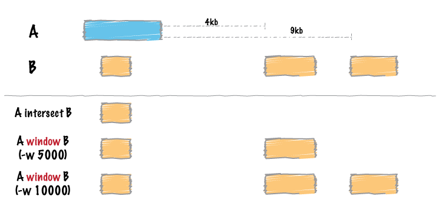
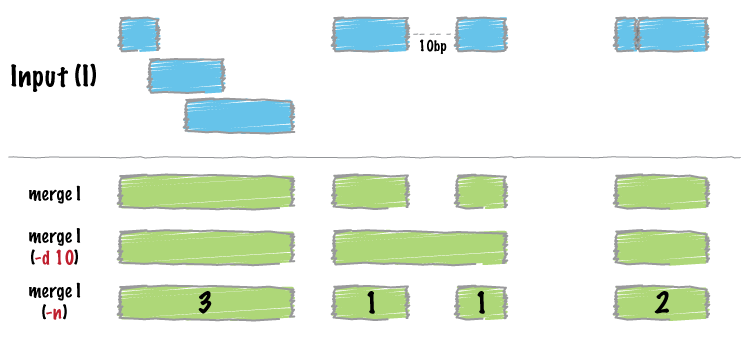

#BEDTools

---
#BED Format

* One of several [file formats](http://genome.ucsc.edu/FAQ/FAQformat.html#format1) developed and supported by UC Santa Cruz
  Browser team.
* BED - [Browser Extensible Data](http://users.soe.ucsc.edu/~kent/gbd.html#BED)
* Simple format but has extensibility
* First 3 columns are required (chrom,start,end)
* Additional columns are (name,score,strand) 
 
---
#GFF Format

* Gene Feature Format or Generic Feature Format
* 9 columns, chromosome, source, type, start,end, score, strand,
  score, name

        chr22  TeleGene enhancer  10000000  10001000  500 +  .  touch1
		chr22  TeleGene promoter  10010000  10010100  900 +  .  touch1
		chr22  TeleGene promoter  10020000  10025000  800 -  .  touch2

---
#BEDTools

* "need for fast, flexible tools with which to compare large sets of
  genomic features"
* See the documentation [here](http://bedtools.readthedocs.org/en/latest/)
* Do intersection, union of the features
* Also calculate coverage (e.g. number of SNPs or number of reads) 
*

---
#Running BEDtools: intersect

Look for overlaps

	# report the SNPs which overlap genes
	$ cd /shared/gen220/data_files/features/
	$ bedtools intersect -a HEG4.SNPs.vcf -b  rice_chr6.gff
	$ bedtools intersect -a HEG4.SNPs.vcf -b rice_chr6_genesonly.gff
	# report the same but print out the gene feature too - use the -wo option
	$ bedtools intersect -a HEG4.SNP.vcf -b rice_chr6.gff -wo
	# report the gene features which don't have SNPs

---
#BEDtools: window

Can do the same thing as intersect but allows the features to be
'grown'. 

---
#BEDtools: merge

Merge features that are nearby (or overlapping). Useful for NGS reads
and merging coverage

---
#BEDtools: muticov

* "eports the count of alignments from multiple position-sorted and
  indexed BAM files that overlap intervals in a BED
  file. Specifically, for each BED interval provided, it reports a
  separate count of overlapping alignments from each BAM file."

* So calculate the coverage, by reads, of features

    # 
	$ bedtools multicov -bams HEG4.tophat.bam -bed rice_chr6_genesonly.gff
